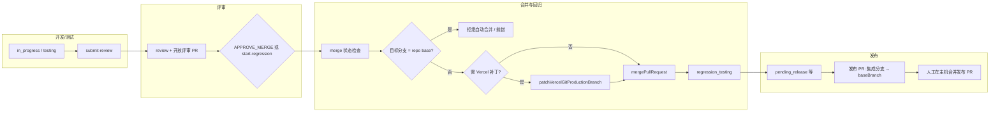

# GitHub 与 Vercel 在 Kanban 项目流中的作用

本文档归纳 **GitHub（SCM）** 与 **Vercel（部署）** 在本仓库 Kanban 工作流中的职责、触发时机与运维侧注意事项。内容与实现以 `src/platform/workflow-service.ts`、`src/platform/scm-client.ts` 及前后讨论为准。

## 总览

| 系统 | 主要职责 |
|------|----------|
| **GitHub** | 托管仓库、评审 PR、由 Kanban **可选地**调用 API **自动合并**「评审 PR」；发布阶段还可存在「发布 PR」由人工合并进默认分支。 |
| **Vercel** | 在**自动合并评审 PR 之前**，可按项目配置将 **Git Production Branch** 对齐到当前 **Sprint / 集成分支**，使合并后的 Production 部署与分支策略一致。 |

---

## GitHub：在流程里做什么

### 1. 分支与 PR 类型（概念上）

- **任务开发分支**：如 `dev/<issue>`，在开发/测试阶段使用。
- **评审 PR（Review PR）**：通常由 `submit-review` 打开，**合并目标（base）一般为当前 Sprint 的集成分支**（`sprint.branchName`，例如 `feature/sprint-x`），而不是仓库默认分支。若误将 base 配成 `main`/`master`，会与「先合入集成分支再回归」的设计不一致。
- **发布 PR（Release PR）**：在 `pending_release` 等阶段可能出现，用于将集成分支合入 **`project.repository.baseBranch`**（如 `main`）。代码路径里强调 **在主机上人工合并** 发布 PR，而不是由评审合并 API 一键合进 base。

### 2. Kanban 何时会「自动合并」GitHub PR

服务端在 **`mergeApprovedPullRequestAndStartRegression`** 中，在满足主机 merge 条件时调用 **`scmClient.mergePullRequest`**（GitHub：`PUT .../pulls/{n}/merge`）。典型入口包括：

- 评审在 **review** 阶段输出 **`KANBAN_ACTION:APPROVE_MERGE`**；
- HTTP **`POST /api/workflows/tasks/:taskSessionId/start-regression`**（任务处于 **review** 且存在可合并的开放 PR）。

因此：**自动合并的是「评审 PR」这条线**，不是「创建 PR」本身；创建/更新 PR 由提交流程完成，合并是单独一步。

### 3. 合并前的主机校验

- 会先 **`getPullRequestMergeStatus`**（可合并性、是否已 merged/closed 等）。
- 若主机上 **已经 merged**，则**不再调用 merge API**，直接进入回归启动逻辑（与「只拦自动合并调用」一致）。

### 4. 禁止合入仓库默认分支（自动合并）

若主机上该开放 PR 的 **合并目标分支**（GitHub API 的 `base.ref`）与 **`project.repository.baseBranch`** **相同**，Kanban **会拒绝执行自动合并**并 `throw`，避免把评审 PR 直接合进生产默认分支。

- 实现位置：`WorkflowService.assertKanbanDoesNotAutoMergeIntoRepositoryBase`（在 Vercel 补丁与 `mergePullRequest` 之前）。
- **不修改**创建 PR 的规则；**仅**在即将调用合并 API 时拦截。
- 主机返回的 merge 状态中会携带 **`mergeTargetBranch`**（由 `HttpScmClient` 从 GitHub/GitLab 响应填充），供上述判断使用。

### 5. 在 GitHub 上如何区分「谁点的合并」

- 使用 PAT/用户 token 调用 Merge API 时，GitHub 上常显示为 **该用户** merged，`performed_via_github_app` 可能为 **null**。
- 因此：**仅凭 GitHub 界面无法严格区分「Kanban 服务端合并」与「同一用户在网页上手动合并」**；需要结合应用日志、任务工作流评论、或企业 Audit Log（若可用）。

### 6. Agent 监控页（`/board/monitor`）能否看到「合并操作」

- 监控数据来自 **`kanban_agent_turns`**：在 **某角色 Agent 即将执行一轮对话** 时写入，不是 SCM 审计日志。
- **不会**单独记录「调用了 merge API」这类一行事件；合并后启动回归测试可能会很快出现 **tester** 等新回合，仅能作**间接**佐证。
- 更贴近合并事实的线索通常在 **任务 `historyComments` / `appendWorkflowComment`**（例如已合并说明）或 **PR 讨论区工作流评论**。

---

## Vercel：在流程里做什么

### 1. 目的

在 **自动合并评审 PR** 之前，将 Vercel 项目的 **Production Git Branch** 与当前工作流中的 **合并目标分支（Sprint 分支，`mergeTarget` / `sprint.branchName`）** 对齐，避免合并后 Production 仍指向错误分支，导致部署与分支现实不一致。

### 2. 何时执行

在 **`mergeApprovedPullRequestAndStartRegression`** 中，当**同时**满足：

- 主机侧 **将要由 Kanban 发起合并**（`terminalState !== 'merged'` 且 `canMerge`）；
- **`project.deployment.enabled` 未显式关闭**（`!== false`）；
- **`project.deployment.applyVercelGitProductionBranchPatch` 未显式关闭**（`!== false`）；

则会调用 **`patchVercelGitProductionBranch(project, mergeTarget)`**。

若 PATCH 失败，工作流会 **中止合并**、写工作流说明，并将任务 **退回开发**（与合并不可行类似的处理），避免在无正确 Vercel 配置的情况下强行合并。

### 3. 与 GitHub 自动合并的先后顺序（要点）

1. 主机 merge 状态检查（含 **是否针对 `baseBranch` 的自动合并拦截**）。
2. （通过检查后）**Vercel Production Branch 补丁**（若启用部署相关选项）。
3. **`mergePullRequest`**（GitHub/GitLab 合并 API）。
4. 停止实例、拉取、进入 **regression_testing** 等后续步骤。

---

## 端到端流程（简图）

（上图省略失败打回开发、主机已 merged 跳过 merge API 等分支。）

---

## 运维建议

1. **评审 PR 的 base** 应稳定在 **Sprint/集成分支**；仓库 **默认分支** 仅通过 **发布 PR + 人工确认** 或既定发布流程合入。
2. 排查「谁合并了 PR」时：**监控页不足以定责**；应查 **同一时间的 Kanban 日志、任务评论、`platform.db` 中任务状态**，并结合 GitHub。
3. 使用 Vercel 时，确认 **`deployment`** 相关开关与 CLI/权限满足 **`patchVercelGitProductionBranch`** 的要求，否则合并前会失败并退回开发。

---

## 相关源码入口

| 主题 | 文件 |
|------|------|
| 合并 + 回归 + Vercel 补丁顺序 | `src/platform/workflow-service.ts`（`mergeApprovedPullRequestAndStartRegression`） |
| GitHub/GitLab API、PR base 字段 | `src/platform/scm-client.ts`（`PullRequestMergeStatus.mergeTargetBranch`） |
| HTTP 路由 `start-regression` | `src/platform/app.ts` |
| Agent 监控数据源 | `src/app/board/monitor/page.tsx`，表 `kanban_agent_turns` |

---

*文档版本：与「禁止向 `repository.baseBranch` 自动合并评审 PR」行为同步；若工作流变更，请同步更新本节。*
